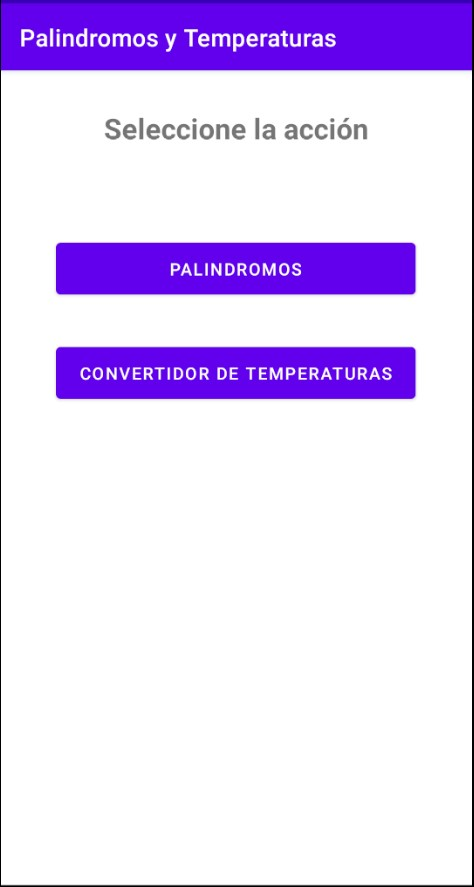
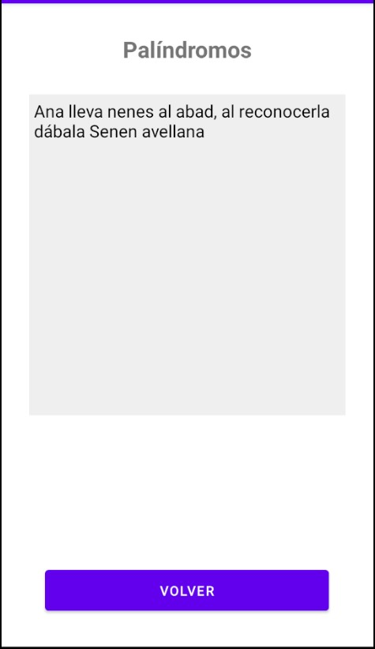
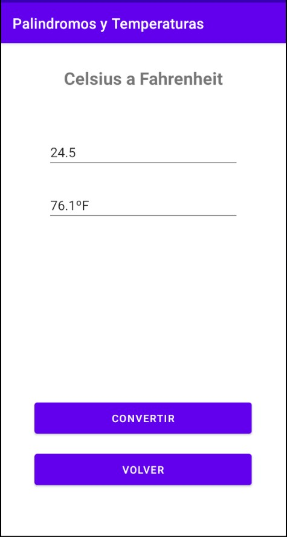

# ISTEA TP1

Aplicación con dos botones que llevan a actividades distintas. Cada actividad resuelve un problema:

1. Un palíndromo 
2. Un algoritmo que permita convertir una temperatura de grados Celsius a Fahrenheit

## Aplicación

La pantalla principal presenta un titulo y dos botones que direccionan a las activities de cada punto solicitado (1 y 2).

#### 1- Palíndromos

Esta activity tiene un `textView` que muestra un palíndromo random (almacenado en una colección local) y un botón para volver a la pantalla principal. Cada vez que se ingrese se mostrará un palíndromo diferente.

#### 2- Convertir temperaturas

En esta activity se muestran dos editText, el primero es donde se ingresa la temperatura en Celsius, en el segundo la conversión a Fahrenheit. En la parte inferior el botón **Convertir** dispara el calculo  y el botón **Volver** lleva a la pantalla principal.

